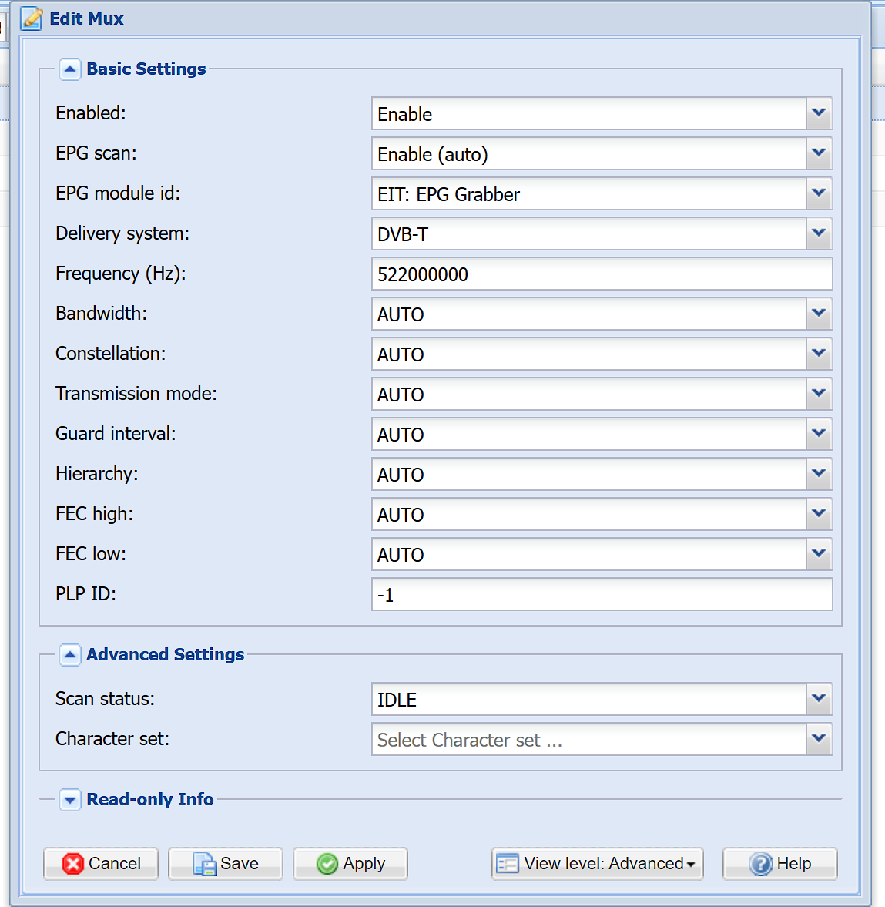
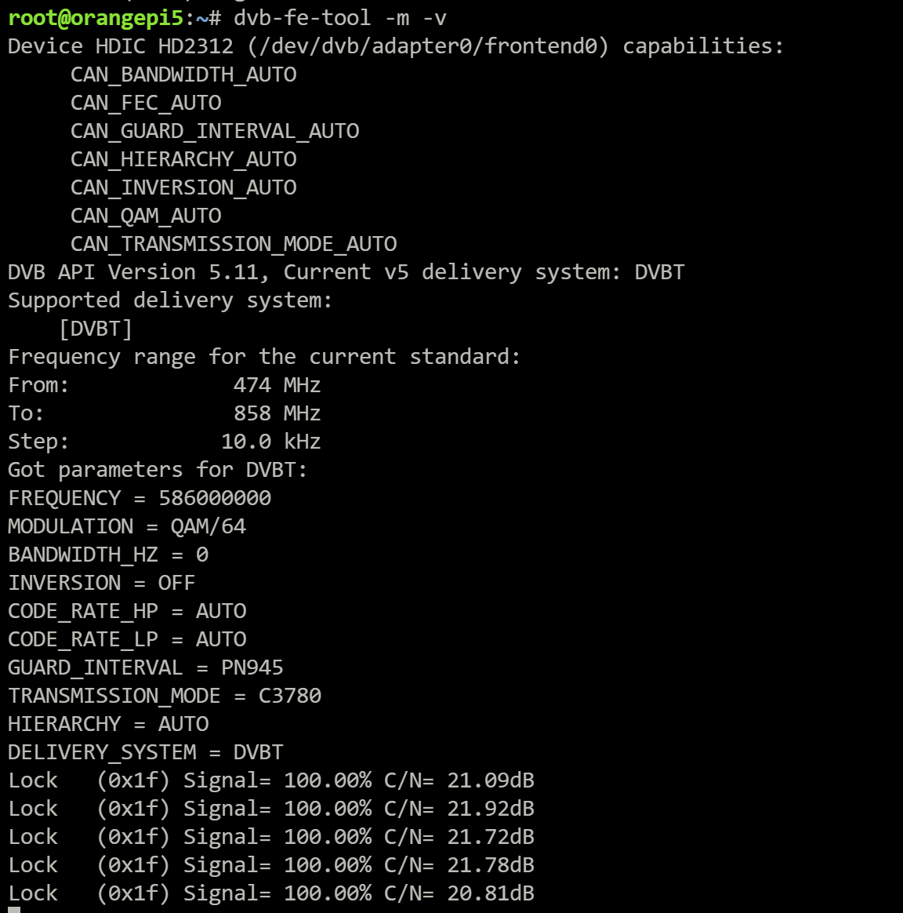

# Linux DVB driver for NERC DTV (CY68013A+HDIC HD2312) DTMB/DMB-TH USB adapter

#### 使用DKMS本地编译

```shell
# 安装内核头文件和dkms工具，以Ubuntu/Debian为例
sudo apt install dkms linux-headers-$(uname -r)

# 下载源码到/usr/src/hd2312-1.0
git clone https://github.com/hanwckf/hd2312.git /usr/src/hd2312-1.0

# 使用dkms构建并安装内核模块
dkms add -m hd2312/1.0
dkms build -m hd2312/1.0
dkms install -m hd2312/1.0
```

#### 使用openwrt编译
```shell
# 下载源码
git clone https://github.com/hanwckf/hd2312.git
cd hd2312

# 将`openwrt/dvb-kconfig`文件内容追加到`target/linux/generic/config-<内核版本号>`文件末尾
cat openwrt/dvb-kconfig >> <openwrt-source>/target/linux/generic/config-<kver>

# 将dvb.mk复制到openwrt内核模块包目录
cp openwrt/dvb.mk <openwrt-source>/package/kernel/linux/modules/

# 创建hd2312软件包
mkdir <openwrt-source>/package/hd2312
cp openwrt/Makefile <openwrt-source>/package/hd2312/

# 在menuconfig里打开kmod-dvb-hd2312
cd <openwrt-source>
make menuconfig

# 开始编译
make V=s

```

#### 使用LibreELEC/CoreELEC编译
```shell
# 下载源码
git clone https://github.com/hanwckf/hd2312.git
cd hd2312

# 创建hd2312软件包
mkdir <LibreELEC-source>/packages/linux-drivers/HD2312
cp libreelec/package.mk <LibreELEC-source>/packages/linux-drivers/HD2312/

# 修改编译设置
cd <LibreELEC-source>
# 对于LibreELEC
echo 'ADDITIONAL_DRIVERS+=" HD2312"' >> ./distributions/LibreELEC/options
# 对于CoreELEC
echo 'ADDITIONAL_DRIVERS+=" HD2312"' >> ./distributions/CoreELEC/options

# 开始编译
# PROJECT=Generic ARCH=x86_64 make image
# PROJECT=Amlogic-ce ARCH=aarch64 make image
```

#### 使用Linux源码树编译

```shell
# 配置内核源码树，打开CONFIG_DVB_USB选项
# make menuconfig
# make modules_prepare

# 下载源码
git clone https://github.com/hanwckf/hd2312.git
cd hd2312

# 设定目标KDIR并开始编译

make KDIR=<path/to/kernelsource>
```

#### 使用说明

1. tvheadend里选择DVB-T制式，填入频率即可，其它解调设置选择AUTO



2. 支持dvb-fe-tool, dvbv5-scan, dvbv5-zap等基于dvbv5api的Linux工具



#### 已知问题
1. openwrt下拔出USB后，udev无法自动移除`/dev/dvb/adapter*`节点，待修复。其它主流Linux发行版无此问题。

#### 参考资料
- https://www.cnblogs.com/DirWang/p/17063658.html
- https://www.linuxtv.org/wiki/index.php/LeTV_DTMB_USB_stick
